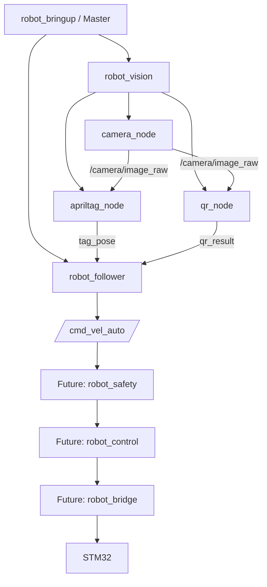

# Delivery Robot ROS2 Workspace (Skeleton)

ROS2 기반 자율주행 배달로봇의 소프트웨어 아키텍처 **skeleton**입니다.

지금 목표 : 알고리즘 완성이 아니라, **패키지 구조 / Node 구조 / Topic 연결 / Launch / Config / Build가 정상 동작하는 큰 틀**을 만들기

각 알고리즘 자리에는 `TODO: USER IMPLEMENTATION` 블록이 있으며, 이후 직접 채워 넣습니다.

## 1. 프로젝트 목적

- Master(bringup) / Vision / Follow 3개 패키지로 실행 가능한 ROS2 시스템 구성
- Vision → Follower 사이의 Topic 인터페이스 확정
- 향후 `robot_safety`, `robot_control`, `robot_bridge`, `robot_ui`, `robot_led`, `robot_manager`, `robot_interfaces` 패키지를 **구조를 크게 바꾸지 않고** 추가

## 2. 전체 Architecture



## 3. Package 역할

| Package | 역할 | 현재 내용 |
|---|---|---|
| `robot_bringup` | **Master**. 전체 Node 실행, parameter yaml 로드, launch 관리. 알고리즘 없음 | `launch/robot.launch.py`, `config/robot.yaml` |
| `robot_vision` | **Vision**. 카메라 입력 및 인식 (AprilTag / QR) | `camera_node`, `apriltag_node`, `qr_node`, `config/vision.yaml` |
| `robot_follower` | **Follow**. 목표 위치 → 주행 명령 생성 | `waypoint_follower_node`, `config/follower.yaml` |

## 4. Node 역할

| Node | Package | Subscribe | Publish | 알고리즘 삽입 위치 |
|---|---|---|---|---|
| `camera_node` | robot_vision | (hardware) | `/camera/image_raw` | `init_camera()`, `capture_frame()` |
| `apriltag_node` | robot_vision | `/camera/image_raw` | `/vision/tag_id`, `/vision/tag_pose` | `detect_apriltag()` |
| `qr_node` | robot_vision | `/camera/image_raw` | `/vision/qr_result` | `detect_qr()` |
| `waypoint_follower_node` | robot_follower | `/vision/tag_pose`, `/vision/qr_result` | `/cmd_vel_auto` | `compute_control()` |

## 5. Topic 구조

| Topic | Type | Publisher | Subscriber |
|---|---|---|---|
| `/camera/image_raw` | `sensor_msgs/Image` | camera_node | apriltag_node, qr_node |
| `/vision/tag_id` | `std_msgs/String` | apriltag_node | (future) |
| `/vision/tag_pose` | `geometry_msgs/PoseStamped` | apriltag_node | waypoint_follower_node |
| `/vision/qr_result` | `std_msgs/String` | qr_node | waypoint_follower_node |
| `/cmd_vel_auto` | `geometry_msgs/Twist` | waypoint_follower_node | (future) robot_safety |

향후 추가 Topic naming convention: `/safety/...`, `/control/...`, `/stm32/...`, `/system/...`

Topic 이름은 각 Node 파일 상단의 `TOPIC NAMES` 상수 블록에서 관리하며, yaml 파라미터로 override 할 수 있습니다.

## 6. Parameter

로드 순서 (뒤에 로드된 파일이 우선):

1. `robot_vision/config/vision.yaml` → vision node 기본값
2. `robot_follower/config/follower.yaml` → follower node 기본값
3. `robot_bringup/config/robot.yaml` → **시스템 레벨 override (마지막 로드, Master 스위치)**

핵심 스위치:

| Parameter | Node | 기본값 | 의미 |
|---|---|---|---|
| `use_camera` | camera_node | `false` | false면 hardware 접근 없이 mock mode (검은 프레임 publish) |
| `enable_motion` | waypoint_follower_node | `false` | false면 어떤 입력이 와도 `/cmd_vel_auto` = 0 |

`enable_motion`은 실행 중에도 바꿀 수 있습니다:

```bash
ros2 param set /waypoint_follower_node enable_motion true
```

## 7. Build

```bash
cd ~/delivery_robot_ws
colcon build --symlink-install
source install/setup.bash
```

## 8. Launch

```bash
ros2 launch robot_bringup robot.launch.py
```

## 9. 확인

```bash
ros2 node list
ros2 topic list
ros2 topic hz /camera/image_raw
ros2 topic echo /cmd_vel_auto
```

## 10. 가짜 입력으로 인터페이스 테스트

```bash
# 가짜 tag pose
ros2 topic pub -r 5 /vision/tag_pose geometry_msgs/msg/PoseStamped \
  "{header: {frame_id: camera_link}, pose: {position: {x: 1.0, y: 0.0, z: 0.0}, orientation: {w: 1.0}}}"

# 가짜 QR 결과
ros2 topic pub -1 /vision/qr_result std_msgs/msg/String "{data: 'DEST_A'}"
```

## 11. 안전 원칙

- `/cmd_vel_auto` 기본값은 항상 `linear.x = 0.0`, `angular.z = 0.0`
- `enable_motion = false`(기본)이면 cmd_vel = 0 유지
- target이 `target_timeout_sec` 이상 오래되면 lost로 간주 → cmd_vel = 0
- Follower는 STM32 / Motor에 직접 접근하지 않음

```
Follower → /cmd_vel_auto → Safety → /cmd_vel_safe → Control → Bridge → STM32
```

## 12. 향후 TODO

- [ ] `camera_node`: 실제 카메라 드라이버 (OAK-D / USB / CSI)
- [ ] `apriltag_node.detect_apriltag()`: AprilTag detection + pose estimation
- [ ] `qr_node.detect_qr()`: QR decoding
- [ ] `waypoint_follower_node.compute_control()`: Pure Pursuit / PID / Waypoint following
- [ ] `/odom`, `/waypoints` 입력 추가
- [ ] 패키지 추가: `robot_safety`, `robot_control`, `robot_bridge`, `robot_ui`, `robot_led`, `robot_manager`, `robot_interfaces`
